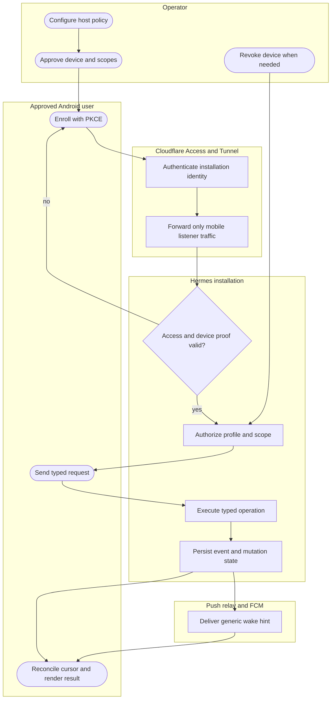
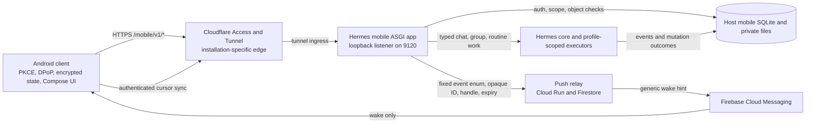
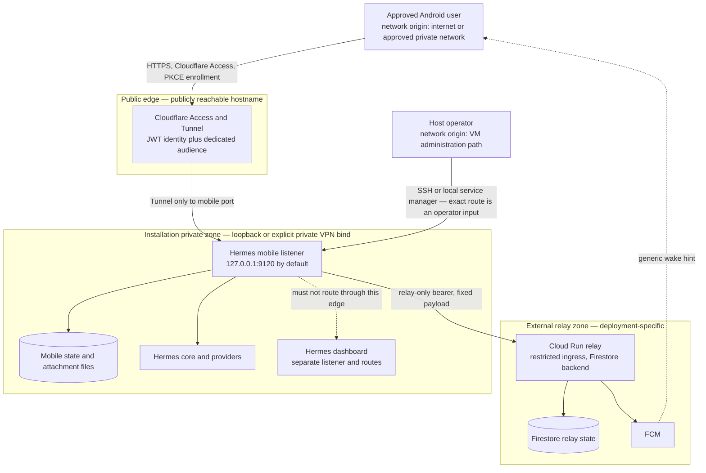
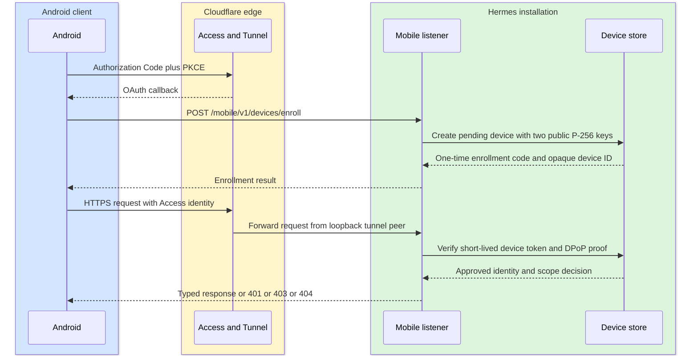
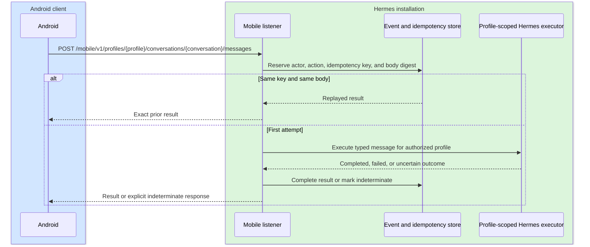
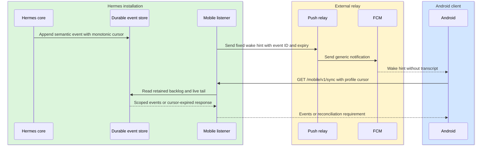
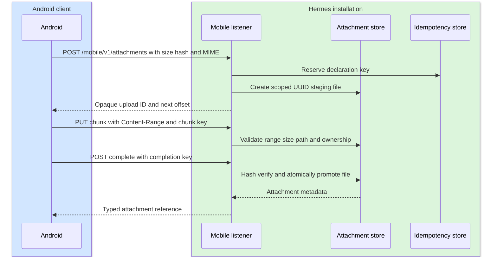
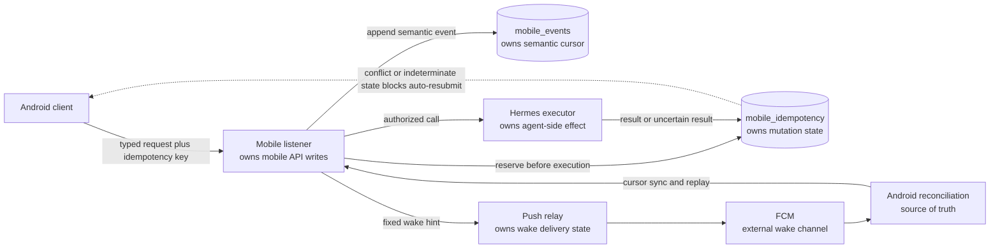
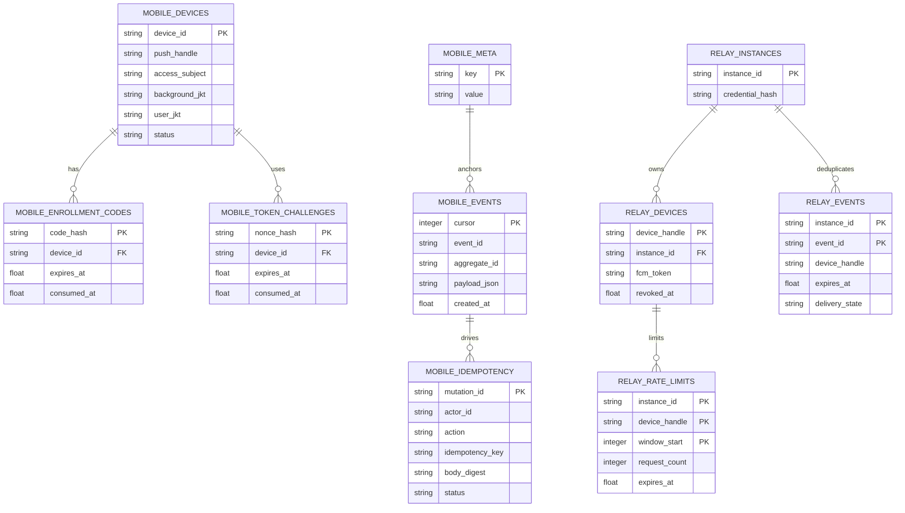

# Design Document — Hermes Mobile R1

> Design-review document for the Hermes Mobile Android client, isolated mobile API, and optional
> push relay. This document describes the current checkout and explicitly separates code evidence
> from deployment and owner inputs. The companion docs-scoped dossier is [`PROJECT.md`](PROJECT.md).

**Review posture:** implementation present, release gates incomplete. No diagram or section below
is evidence that a VM, Cloudflare application, Cloud Run service, Firebase project, APK, or release
signature exists.

## Product Overview and Objectives

- **What it is:** An Android client for selected Hermes profiles and conversations, backed by a
  sibling FastAPI listener that exposes typed `/mobile/v1/*` routes for profiles, chat, groups,
  runs, attachments, approvals, routines, settings, devices, durable sync, and push registration.
  The listener is intentionally separate from the dashboard and JSON-RPC app
  (`hermes_cli/mobile_server.py:1-5`).
- **Intended users:** An operator-approved device owner, with access limited by the host's profile
  and scope allowlists. Exact audience and support ownership are owner inputs, not inferred here.
- **Objectives:** keep the mobile trust boundary narrow, bind every request to Cloudflare Access plus
  device proof, preserve profile/object isolation, make mutations replay-safe, and keep sensitive
  content out of logs and push payloads. These objectives are reflected in
  [`security/hermes-mobile-threat-model.md`](security/hermes-mobile-threat-model.md:6-12).
- **PRD:** ⚠️ No separate PRD was found in this checkout. Release requirements are recorded in
  [`PROJECT.md`](PROJECT.md) and the deployment runbook.

## Business Workflow

**Intent:** an operator configures one Hermes installation, approves one Android device with the
  smallest useful profile/scope set, and the device performs typed, authorized work. A push is only
  a wake hint. The authenticated cursor sync is the source of truth.

The code proves the route and state transitions; the business owner must still confirm the exact
user population, criticality, supported workflows, and success criteria before release.

## Architecture Diagrams

### A. Component and Deployment Diagram

**Component view**

The startup wiring creates separate stores and injects them into the isolated listener
(`hermes_cli/mobile_startup.py:286-398`). The push client contract rejects non-HTTPS origins and
sends only fixed fields (`hermes_cli/mobile_push.py:19-103`).

**Deployment and access boundary**

The source enforces loopback unless `mobile.allow_private_bind` explicitly enables a private
address and rejects wildcard/public binds (`hermes_cli/mobile_startup.py:200-244`). The runbook
requires the tunnel ingress to contain only the mobile hostname and forbids dashboard, PTY,
filesystem, and generic RPC routing (`docs/deployment/hermes-mobile-ugreen-vm.md:37-52`). The
actual network zone, hostname, tunnel, and operator route remain ⚠️ deployment inputs.

### B. Sequence Diagrams and System Boundaries

Colored financial-flow rectangles are intentionally absent: no payment, wallet, balance, ledger,
or financial-asset operation was found in the mobile implementation. Operational side effects are
shown with their idempotency and recovery boundaries.

**Use case: enrollment and an authenticated request**

Cloudflare JWT validation requires a loopback peer, pinned issuer, audience, expiry, and JWKS
signature (`hermes_cli/mobile_auth.py:55-102`). The composed authorizer then requires the device
token, DPoP, Access-subject binding, and rate limits (`hermes_cli/mobile_request_auth.py:95-159`).

**Use case: direct chat mutation with uncertain external work**

The event store persists `pending`, `succeeded`, `failed`, and `indeterminate` mutation states with
a unique `(actor_id, action, idempotency_key)` constraint (`hermes_cli/mobile_event_store.py:573-594`).
The chat route reserves and completes mutations around execution (`hermes_cli/mobile_server.py:2237-2307`).
Group turns use the same durable mutation boundary and advance members serially for at most three
rounds or ten total responses; each response is leased and fenced by the coordinator before the
next member is invoked (`hermes_cli/mobile_group_execution.py:35-218`, `mobile_groups.py:605-794`).
`GET /mobile/v1/groups` reconciles the owner/device-scoped durable group snapshot and omits any
group whose member profile grant or host binding is no longer valid; Android uses this list before
falling back to an opaque cached group reference. The bounded response carries `has_more` and an
installation/owner/device-bound `next_cursor`; Android follows every cursor and only deletes cached
groups after assembling the complete snapshot (`hermes_cli/mobile_groups.py:430-490`,
`hermes_cli/mobile_server.py:2900-2973`).

**Use case: event sync and push wake**

The listener uses a durable event store and returns an expired-cursor signal rather than silently
losing history (`hermes_cli/mobile_event_store.py:195-205`, `551-611`; `hermes_cli/mobile_server.py:950-1015`).
The Android README states that FCM is only a wake hint and authenticated sync is authoritative
(`apps/android/README.md:80-88`).

**Use case: attachment upload**

The route bounds chunk size and applies idempotency (`hermes_cli/mobile_server.py:2862-3078`),
while the store rejects path traversal and symlinks, enforces quotas, and validates hash/MIME
(`hermes_cli/mobile_attachments.py:391-435`, `549-588`, `678-765`).

### C. Queue and Data Storage for Operational Side Effects

There is no financial ledger or payment queue. The equivalent integrity flow is the durable event
and mutation path for agent side effects:

- **Transaction ownership:** the mobile listener owns mobile mutation and event-store writes;
  profile-scoped Hermes executors own the agent turn or external side effect. The relay owns only
  wake-delivery deduplication, not transcript or run state.
- **Upstream access:** Android reaches the listener through the dedicated edge. The listener calls
  injected Hermes services. The relay receives only the fixed contract documented in
  `services/mobile_push_relay/README.md:1-8`.
- **Failure and recovery:** pending mutations recover to `indeterminate`; uncertain work is not
  automatically resubmitted. Cursor expiry triggers snapshot reconciliation. Relay delivery may
  be retried, but FCM is never treated as the source of truth. These rules are implemented in
  `hermes_cli/mobile_event_store.py:195-205`, `464-531`, direct-run fencing in
  `hermes_cli/mobile_chat.py:366-448`, and startup wiring in
  `hermes_cli/mobile_startup.py:392-395`; they are tested by
  `tests/hermes_cli/test_mobile_event_store.py:30-189` and
  `tests/hermes_cli/test_mobile_chat.py:133-181`.

## Database Schema

The mobile implementation uses multiple host-local SQLite/WAL stores plus a production relay
Firestore backend. Database names and fields below are taken from the DDL in the source. Domain
tables not expanded in the compact field tables are listed in the inventory with their DDL source;
an owner should confirm retention, backup, and migration policy before release.

### Core security and synchronization tables

**`mobile_devices`** — `hermes_cli/mobile_devices.py:495-510`

| Field | Type | Nullable | Key | Description |
|---|---|---:|---|---|
| `device_id` | text | no | PK | Opaque host device identity |
| `push_handle` | text | yes at migration, then unique | UNIQUE | Opaque relay handle |
| `device_label` | text | no | — | Operator-visible label |
| `access_subject` | text | no | — | Cloudflare identity binding |
| `access_email` | text | no | — | Access claim retained for operator view |
| `background_jwk` | text | no | — | Public ordinary-request key |
| `user_jwk` | text | no | — | Public user-presence step-up key |
| `background_jkt` | text | no | — | Background key thumbprint |
| `user_jkt` | text | no | — | User key thumbprint |
| `profile_allowlist` | text | no | — | Serialized approved profile names |
| `scope_allowlist` | text | no | — | Serialized approved scopes |
| `status` | text | no | — | `pending`, `approved`, or `revoked` |
| `created_at` | real | no | — | Enrollment creation time |
| `approved_at` | real | yes | — | Approval time |
| `revoked_at` | real | yes | — | Revocation time |

**`mobile_enrollment_codes` and `mobile_token_challenges`** —
`hermes_cli/mobile_devices.py:512-531`

| Table | Field | Type | Nullable | Key | Description |
|---|---|---|---:|---|---|
| `mobile_enrollment_codes` | `code_hash` | blob | no | PK | Hashed one-time enrollment code |
| `mobile_enrollment_codes` | `device_id` | text | no | FK | Pending device |
| `mobile_enrollment_codes` | `expires_at` | real | no | — | Enrollment expiry |
| `mobile_enrollment_codes` | `consumed_at` | real | yes | — | Single-use redemption marker |
| `mobile_token_challenges` | `nonce_hash` | blob | no | PK | Hashed token-refresh challenge |
| `mobile_token_challenges` | `device_id` | text | no | FK | Challenged device |
| `mobile_token_challenges` | `expires_at` | real | no | — | Challenge expiry |
| `mobile_token_challenges` | `consumed_at` | real | yes | — | Single-use marker |

**`mobile_meta`, `mobile_events`, and `mobile_idempotency`** —
`hermes_cli/mobile_event_store.py:551-594`

| Table | Field | Type | Nullable | Key | Description |
|---|---|---|---:|---|---|
| `mobile_meta` | `key` | text | no | PK | Store metadata key such as instance and cursor floor |
| `mobile_meta` | `value` | text | no | — | Metadata value |
| `mobile_events` | `cursor` | integer | no | PK | Monotonic sync cursor |
| `mobile_events` | `event_id` | text | no | UNIQUE | Semantic event identity |
| `mobile_events` | `event_type` | text | no | — | Typed event enum |
| `mobile_events` | `aggregate_type` | text | no | — | Aggregate kind |
| `mobile_events` | `aggregate_id` | text | no | — | Opaque aggregate identity |
| `mobile_events` | `payload_json` | text | no | — | Event payload subject to log/data policy |
| `mobile_events` | `created_at` | real | no | — | Event creation time |
| `mobile_events` | `tombstone` | integer | no | — | Retention tombstone flag |
| `mobile_idempotency` | `mutation_id` | text | no | PK | Mutation claim identity |
| `mobile_idempotency` | `actor_id` | text | no | — | Device actor identity |
| `mobile_idempotency` | `action` | text | no | — | Typed mutation action |
| `mobile_idempotency` | `idempotency_key` | text | no | UNIQUE with actor/action | Caller retry key |
| `mobile_idempotency` | `body_digest` | text | no | — | Conflict detector for reused keys |
| `mobile_idempotency` | `status` | text | no | — | `pending`, `succeeded`, `failed`, or `indeterminate` |
| `mobile_idempotency` | `status_code` | integer | yes | — | Stored HTTP result code |
| `mobile_idempotency` | `result_json` | text | yes | — | Stored typed result |
| `mobile_idempotency` | `owner_pid` | integer | no | — | Claiming process |
| `mobile_idempotency` | `owner_token` | text | no | — | Claiming process token |
| `mobile_idempotency` | `created_at` | real | no | — | Claim creation time |
| `mobile_idempotency` | `updated_at` | real | no | — | Last state change |

### Host object and relay stores

| Store/table | Key fields | Evidence and release note |
|---|---|---|
| `mobile_object_metadata`, `mobile_profile_bindings` | `instance_id`, `profile_name`, `opaque_profile_id` | Opaque profile IDs are stable per host and never expose names or paths (`hermes_cli/mobile_objects.py:36-57`). |
| `mobile_rate_limits` | principal hash, action, window, count | Partitioned rate limits for user, device, and profile (`hermes_cli/mobile_rate_limit.py:26-31`; `hermes_cli/mobile_request_auth.py:68-115`). |
| settings, approvals, routines, chat, and groups stores | Profile/device ownership, revisions, audit, runs, leases, and state | DDL is in `hermes_cli/mobile_settings.py:236-268`, `mobile_approvals.py:197-217`, `mobile_routines.py:177-213`, `mobile_chat.py:304-356`, and `mobile_groups.py:1046-1110`. Retention, backup, and migration ownership are ⚠️ owner inputs. |
| `relay_instances` | `instance_id`, `credential_hash` | Relay-only credential ownership (`services/mobile_push_relay/app.py:104-107`). |
| `relay_devices` | `device_handle`, `instance_id`, `fcm_token`, `revoked_at` | Opaque device-to-instance routing (`services/mobile_push_relay/app.py:108-113`). |
| `relay_events` | `(instance_id, event_id)`, handle, expiry, delivery state | Deduplication and retry lease (`services/mobile_push_relay/app.py:114-123`). |
| `relay_rate_limits` | instance, device, window, count, expiry | Relay rate-limit state (`services/mobile_push_relay/app.py:124-131`). |

## External Connections and Integrations

| Integration | Direction | What | Why | Where | When | Protocol and auth |
|---|---|---|---|---|---|---|
| Cloudflare Access and Tunnel | inbound | Access JWT and HTTPS mobile requests | Public edge identity and transport to one installation | Installation-specific hostname and loopback tunnel | Every mobile request and enrollment | HTTPS via tunnel; listener validates RS256 JWT issuer, audience, expiry, and loopback peer (`hermes_cli/mobile_auth.py:75-102`) |
| OAuth authorization server | both | Authorization code, PKCE token response, issuer/resource claims | Android enrollment | Coordinates supplied through `BuildConfig` | User enrollment and token refresh | Authorization Code + PKCE S256 in an external Custom Tab (`apps/android/README.md:42-61`) |
| Android ↔ mobile listener | both | Typed JSON, DPoP, device token, idempotency key, cursors, opaque IDs | Mobile functions and reconciliation | HTTPS public origin pinned in Android and host config | User actions, WorkManager wake, and sync | HTTPS; Cloudflare identity plus device proof; route allowlist (`hermes_cli/mobile_request_auth.py:118-159`; `apps/android/app/build.gradle.kts:20-79`) |
| Hermes core/provider boundary | both | Authorized profile-scoped chat, routine, and group work | Execute agent turns and side effects | Host process and configured providers | Authorized mutations | In-process typed service interfaces; routine dispatch requires an injected host executor and never derives commands from mobile input (`hermes_cli/mobile_routine_worker.py:1-310`; `docs/security/hermes-mobile-threat-model.md:40-54`) |
| Push relay | outbound | Fixed event enum, opaque event ID, device handle, expiry | Wake Android without content leakage | Deployment-specific HTTPS relay URL | Event completion, approval, question, or failure | HTTPS bearer relay credential; client rejects non-HTTPS origins (`hermes_cli/mobile_push.py:19-103`) |
| Cloud Run relay ↔ Firestore | internal to relay | Device handles, hashed credentials, FCM tokens, event dedupe, TTL/rate limits | Durable relay state | GCP project supplied at deployment | Registration, revocation, and push | ADC/Workload Identity; production Firestore required (`services/mobile_push_relay/README.md:8-32`) |
| Cloud Run relay ↔ FCM | outbound | Generic fixed notification and registration token | Deliver wake hint | Firebase project supplied at deployment | Relay push request | Google ADC and Firebase messaging authority (`services/mobile_push_relay/app.py:916-929`) |

No exact hostnames, issuer values, audiences, GCP coordinates, Firebase project, or relay digest
are present in this document or repository. Those are release-environment inputs.

## Financial Risks and Operational Integrity

### Financial surface

**N/A — no financial assets, payments, balances, wallets, loyalty points, or ledgers were detected
in the mobile implementation.** The mobile surface does create operational side effects such as
agent turns, approvals, routines, groups, and settings writes. Those are assessed below so that
“no financial surface” is not mistaken for “no integrity risk.”

### Race conditions

- Device enrollment, DPoP replay, and token challenge stores use transactional SQLite state and
  uniqueness constraints (`hermes_cli/mobile_devices.py:493-531`, `561-569`). **CONFIRMED in local
  tests:** `tests/hermes_cli/test_mobile_devices.py:76-308`.
- Mutation claims use a unique actor/action/key tuple and WAL-backed state
  (`hermes_cli/mobile_event_store.py:573-594`, `796-800`). **CONFIRMED in local tests:**
  `tests/hermes_cli/test_mobile_event_store.py:30-189`.
- Group and routine execution use leases, authority epochs, and explicit indeterminate states
  (`hermes_cli/mobile_groups.py:1077-1109`, `hermes_cli/mobile_routines.py:197-213`,
  `hermes_cli/mobile_routine_worker.py:81-310`). **CONFIRMED in local tests:**
  `tests/hermes_cli/test_mobile_groups.py:111-265`, `tests/hermes_cli/test_mobile_routines.py:56-133`,
  and `tests/hermes_cli/test_mobile_routine_worker.py`.

### Failure models

- **Idempotency:** required on side-effecting routes and persisted with a body digest before work
  (`hermes_cli/mobile_server.py:2237-2307`, `2862-3078`) — **CONFIRMED** by local tests.
- **Retry:** an identical key replays the stored result; a body conflict is rejected. An uncertain
  executor failure is fenced as `indeterminate`, not automatically retried
  (`hermes_cli/mobile_event_store.py:358-464`; `tests/hermes_cli/test_mobile_chat.py:71-130`) —
  **CONFIRMED** in local tests.
- **Compensation/rollback:** completed external side effects are explicitly reported as not undone
  for group work (`hermes_cli/mobile_server.py:2660-2673`; `hermes_cli/mobile_groups.py:903-914`).
  There is no general compensation transaction — **CONFIRMED limitation**, requiring operator
  reconciliation rather than an invented rollback guarantee.

### Duplicate operation detection

- **Mechanism:** `(actor_id, action, idempotency_key)` uniqueness plus body digest and stored result
  (`hermes_cli/mobile_event_store.py:573-594`).
- **Identifiers:** opaque UUID/URL-safe IDs for device, instance, profile, conversation, run,
  group, upload, and event; DPoP `jti` is one-time and expiry-bound (`hermes_cli/mobile_devices.py:38-59`,
  `1110-1153`; `hermes_cli/mobile_objects.py:36-57`).
- **Relay dedupe:** `(instance_id, event_id)` plus a delivery lease and expiry
  (`services/mobile_push_relay/app.py:114-123`).

### API security summary

The full threat model, assets, trust boundaries, principal threats, and fail-closed invariants are
in [`security/hermes-mobile-threat-model.md`](security/hermes-mobile-threat-model.md). The general
Hermes policy is [`../SECURITY.md`](../SECURITY.md).

- **Authentication:** Cloudflare Access JWT plus approved device token and DPoP proof. Android
  enrollment uses PKCE. Live issuer/JWKS and tunnel verification remain pending.
- **Authorization:** host-owned profiles/scopes, device ownership, opaque IDs, route scope checks,
  and step-up proofs for sensitive settings and approvals.
- **Encryption and sensitive data:** HTTPS, Keystore-backed Android keys, encrypted Room/DataStore
  values, private host attachment files, and generic push text are implemented in code/docs; live
  backup, key-loss, and device testing remain pending.
- **Logging/compliance:** fail-closed no-secret/no-message logging is required by the threat model;
  independent review, risk classification, retention, and approvals remain unrecorded.

## Review Checklist

### Architecture

- [x] Product overview provided
- [x] Objectives and non-goals stated
- [x] Business workflow diagram included
- [x] Component diagram included
- [x] Deployment diagram included with public/private zones and login labels
- [x] Sequence diagrams included for enrollment, chat, sync, and attachments
- [x] System boundaries shown with Mermaid `box` and deployment zones
- [x] Role/access differences shown through operator versus approved-device paths
- [x] Mermaid blocks statically linted locally; a Mermaid parser was unavailable on this host

### Data and integrations

- [x] Core database schema documented with DDL-backed fields and an ER diagram
- [x] Operational mutation/event data flow documented
- [x] Queue/data-store architecture documented
- [x] Transaction and side-effect ownership stated
- [x] External connections documented with direction, purpose, protocol, and auth
- [ ] Full domain-table field descriptions and retention/backup ownership confirmed by owner

### Financial and operational risk

- [x] Financial surface explicitly assessed as N/A
- [x] Operational race conditions identified
- [x] Failure models documented: idempotency, retry, indeterminate state, and limits of rollback
- [x] Duplicate-operation prevention documented
- [x] Recovery strategy documented for cursor expiry and uncertain work

### Security and release

- [x] API security cross-referenced to the threat model and root security policy
- [x] Authentication and authorization documented
- [x] Sensitive-data handling documented
- [ ] Formal risk tier and owner/support identities recorded in root `PROJECT.md`
- [ ] Live deployment, Android build/signing, enrollment, and independent approval evidenced
